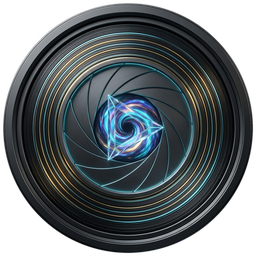
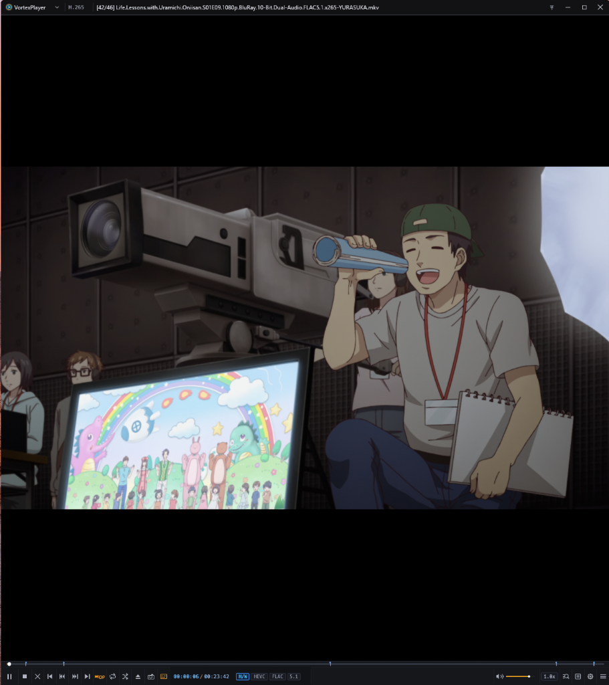
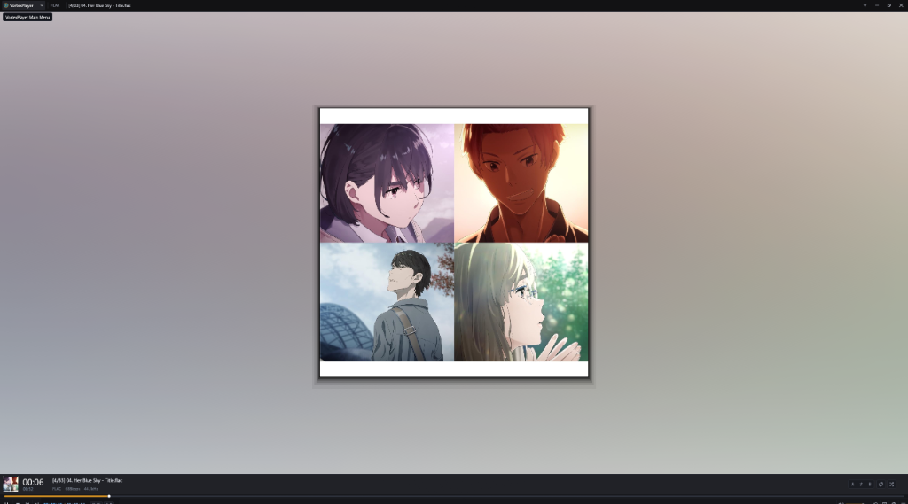
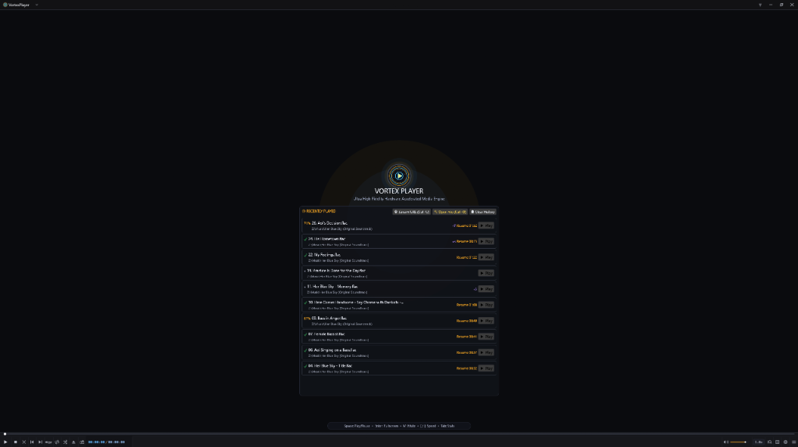
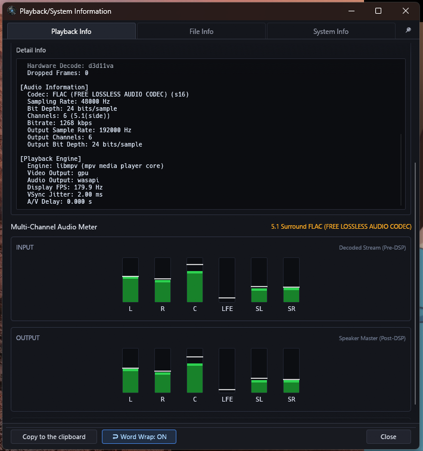
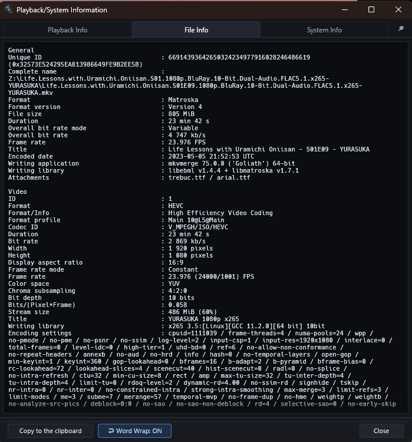
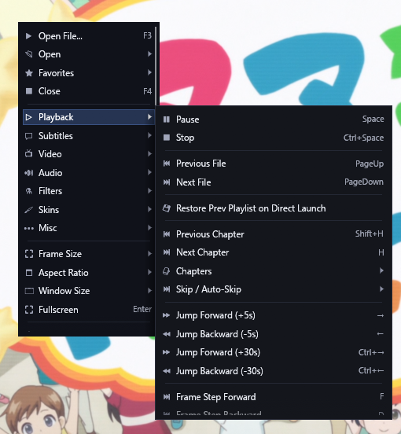

# 🌌 VortexPlayer

> **High-Quality, Modern Media Player built with Rust, egui, and libmpv / Direct3D 11.**  
> Blazing fast performance, native HDR10/HLG color accuracy, 18-band audio DSP, pixel shader studio, and seamless Windows 10/11 integration with zero bloatware or telemetry.

<p align="center">
  
</p>

<p align="center">
  <a href="https://github.com/sidhantjohnaind/VortexPlayer/releases"></a>
  <a href="https://www.rust-lang.org"></a>
  <a href="https://github.com/sidhantjohnaind/VortexPlayer"></a>
  <a href="https://github.com/sidhantjohnaind/VortexPlayer"></a>
  <a href="https://github.com/sidhantjohnaind/VortexPlayer/blob/main/LICENSE"></a>
</p>

---

## ⚡ One-Click Installation

Install VortexPlayer instantly without manual extraction or setup:

### 🪟 Windows (PowerShell)
Run in PowerShell:
```powershell
irm https://raw.githubusercontent.com/sidhantjohnaind/VortexPlayer/main/install.ps1 | iex
```
*Or double-click [`install.bat`](install.bat) directly in Windows Explorer.*

### 🐧 Linux & 🍎 macOS
Run in your terminal:
```bash
curl -fsSL https://raw.githubusercontent.com/sidhantjohnaind/VortexPlayer/main/install.sh | bash
```

---

## 📸 Screenshots & Showcase

### 🎬 Cinema Video Playback & Real-Time HDR

*Ultra-smooth video rendering with Direct3D 11 hardware decoding (`d3d11va`), multi-format audio codec badges (`HEVC`, `FLAC 5.1`), chapter navigation markers, and sleek floating controls.*

---

### 🎵 High-Fidelity Music Player & Ambient Canvas

*Audio playback mode featuring dynamic ambient glow, pure-Rust embedded album art extractor, instant codec statistics (`FLAC 24-bit / 48kHz`), and clean titlebar controls.*

---

### 🌌 Minimalist Startup & Quick-Resume Dashboard

*Clean dark landing interface with recently played tracks, instant resume playback percentages, stream URL opener, and drag-and-drop file support.*

---

### 🎛️ Real-Time 5.1 Audio Meter & Hardware Diagnostics
| 5.1 Surround DSP & Audio Meters | Comprehensive Stream MediaInfo |
| :---: | :---: |
|  |  |
| *Real-time decibel meter for 5.1 channels (L, R, C, LFE, SL, SR) and GPU/WASAPI sync diagnostics* | *Deep format analysis (HEVC 10-bit, audio channels, bitrates, container metadata)* |

---

### ⚡ Deep Context Menu & Power-User Controls
<p align="center">
  
</p>

---

## 📊 Classic Players vs. VortexPlayer Feature Comparison

VortexPlayer elevates the deep power-user feature set of traditional desktop media players within a modern, memory-safe Rust architecture.

### 1. 🎬 Video Rendering & Processing
| Feature | Classic Players | VortexPlayer (Rust) |
| :--- | :---: | :---: |
| **Hardware Acceleration** | DXVA2, D3D11, CUDA, QuickSync | **D3D11VA, DXVA2, NVDEC, VAAPI** |
| **HDR10 & HLG Passthrough** | Direct3D 9/11 HDR | **Direct3D 11 10/12-bit BT.2020 Passthrough** |
| **HDR-to-SDR Tone Mapping** | Built-in pixel shaders / MadVR | **BT.2446a, Spline, Mobius, Reinhard, Hable** |
| **Interactive HDR Control Badge** | Context Menu | **Interactive Bottom Dashboard Golden HDR Badge** |
| **Motion Interpolation (60/144 fps)** | AviSynth / VapourSynth / SVP | **Display-Resample Oversampling Engine** |
| **Pixel Shaders & Studio** | Custom HLSL / GLSL scripts | **In-app Live Shader Studio (`Ctrl+Alt+S`)** |
| **360° VR Spherical Video** | Mouse pan & zoom VR mode | **360° Equirectangular Panoramic VR Mode** |
| **Split Multi-part Video Stitching** | Auto-chains `.part1`, `.001` files | **Auto-detect & Multi-part File Stitching** |
| **Split A/B Video Compare** | Split screen / side-by-side | **Split A/B Compare Slider Tool** |
| **Anime4K & Super-Resolution** | External HLSL filters | **Anime4K Upscaling & Super-Resolution** |

### 2. 🔊 Audio & DSP Engine
| Feature | Classic Players | VortexPlayer (Rust) |
| :--- | :---: | :---: |
| **Equalizer** | 10-band graphic EQ | **18-band High-Precision Parametric EQ** |
| **Channel Configurations** | 1.0 to 7.1 + Auto Passthrough | **1.0, 2.0, 2.1, 3.0, 4.0, 5.0, 5.1, 6.1, 7.1, Same as input** |
| **Dolby & Headphone Virtualization** | Dolby Pro Logic II, Bauer bs2b | **Dolby PL II, Bauer bs2b, HRTF 3D Sofalizer** |
| **Spatial 3D Reverb Simulator** | Freeverb presets (Living Room, Hall) | **Living Room, Concert Hall, Cathedral, Arena** |
| **HDMI / SPDIF Bitstream Passthrough**| TrueHD, Atmos, DTS-HD MA | **Lossless Bitstream HDMI / SPDIF Passthrough** |
| **Audio Normalization** | Volume Normalizer / AGC | **EBU R128 `dynaudnorm` Dynamic Normalizer** |
| **Real-time Audio Visualizer** | Waveform, FFT Bars, VU meters | **LED Matrix, FFT Spectrum, Oscilloscope** |

### 3. 💬 Subtitles & Language Tools
| Feature | Classic Players | VortexPlayer (Rust) |
| :--- | :---: | :---: |
| **Dual Simultaneous Subtitles** | Primary + Secondary subtitle tracks | **Dual Track Subtitle Overlay** |
| **3D Subtitle Z-Depth Parallax** | Z-axis depth displacement | **Flat, Close (+1), Medium (+2), Far (+3)** |
| **Live Word Lookup & TTS** | Bing/Google Translate, SAPI5 TTS | **Instant Dictionary Lookup + Windows TTS Voice** |
| **Online Subtitle Downloader** | OpenSubtitles API integration | **Built-in OpenSubtitles Downloader** |
| **Supported Formats** | ASS, SSA, SRT, VTT, SMI, PGS, SUP | **Full ASS/SSA (libass), SRT, VTT, SMI, PGS** |
| **Styling & Typography** | Font, size, outline, vertical position | **Custom typography, outline, color, position** |

### 4. 📹 Capture, Recording & Broadcast
| Feature | Classic Players | VortexPlayer (Rust) |
| :--- | :---: | :---: |
| **GIF & WebP Animated Maker** | Create GIF from video selection | **A-B Region GIF, WebP & Lossless MP4 Cut (`Ctrl+G`)** |
| **DirectShow Device Input** | Webcam, HDMI capture cards | **Webcam & HDMI Capture Card Passthrough (`Ctrl+W`)** |
| **Live RTMP Broadcast** | Stream playback to Twitch / YouTube | **FFmpeg Live RTMP Broadcast Studio (`Ctrl+B`)** |
| **Thumbnail Contact Sheets** | Grid thumbnail sheet generator | **Customizable Thumbnail Sheet Generator** |
| **Continuous Burst Snapshot** | Capture frames at intervals | **High-speed Burst Capture Engine** |

### 5. 🪟 Windows OS Integration & Control
| Feature | Classic Players | VortexPlayer (Rust) |
| :--- | :---: | :---: |
| **System Media Transport Controls (SMTC)** | Windows 10/11 Lock screen & Flyout | **Native Windows SMTC & Media Keys** |
| **Taskbar Progress Indicator** | Green / Yellow taskbar fill | **Windows `ITaskbarList3` Real-time Progress Bar** |
| **Mouse Gestures** | Customizable directional mouse swipes | **8-direction customizable gesture tracker** |
| **Gamepad & Controller Input** | Xbox / DirectInput controller mapping | **Full Gamepad Controller Mapping Engine** |
| **Web Remote Control** | Web-based smartphone control | **Built-in HTTP Web Remote Control Server** |
| **File Association Manager** | Associates video/audio file types | **Direct Windows Registry Association Manager** |

---

## 🚀 Key Highlights

* **Pure Rust Performance**: Zero bloat, instant startup, zero background telemetry.
* **Native D3D11 HDR Engine**: Output uncompressed 10-bit/12-bit BT.2020 HDR to HDR monitors or dynamic ITU-R BT.2446a tone-mapping to SDR monitors.
* **System Media Transport Controls (SMTC)**: Control playback from the Windows 11 lock screen, action center flyout, and hardware keyboard media keys.
* **18-Band Parametric Audio DSP**: Studio-grade EQ, Bauer binaural crossfeed (bs2b), HRTF 3D audio, and HDMI bitstream passthrough.
* **Pixel Shader Studio**: Live GLSL / HLSL code editor with instant compile and real-time viewport preview.
* **Lossless Clip & GIF Studio**: Export A-B loops to animated GIF, WebP, or lossless stream-copied MP4 cuts.

---

## ⌨️ Shortcut Cheat Sheet

| Shortcut | Action |
| :--- | :--- |
| `Space` | Play / Pause |
| `Left` / `Right` | Seek 5s backward / forward |
| `Up` / `Down` | Volume control (up to 200% soft-boost) |
| `F` / `Enter` | Toggle Fullscreen |
| `Ctrl + O` | Open Media File |
| `Ctrl + U` | Open Network Stream URL |
| `Ctrl + G` | Open Animated GIF & Clip Trimmer Studio |
| `Ctrl + W` | Open DirectShow Webcam / HDMI Capture Card |
| `Ctrl + B` | Open Live RTMP Broadcast Studio |
| `Ctrl + Alt + S` | Open Pixel Shader Studio |
| `F5` | Open Preferences Dialog |
| `F6` | Open Control Center |
| `F7` | Toggle Playlist Panel |
| `Tab` | Toggle OSD Telemetry Diagnostics |
| `[` / `]` | Set A-B Loop Start / End Point |
| `\` | Clear A-B Loop |

---

## 🛠️ Building & Running

### Requirements
* Rust 1.80+ (MSVC toolchain on Windows)
* `mpv-2.dll` (included in project directory)

```bash
# Build release executable
cargo build --release

# Run VortexPlayer
cargo run --release
```

---

## 📄 License
Licensed under the MIT License.
